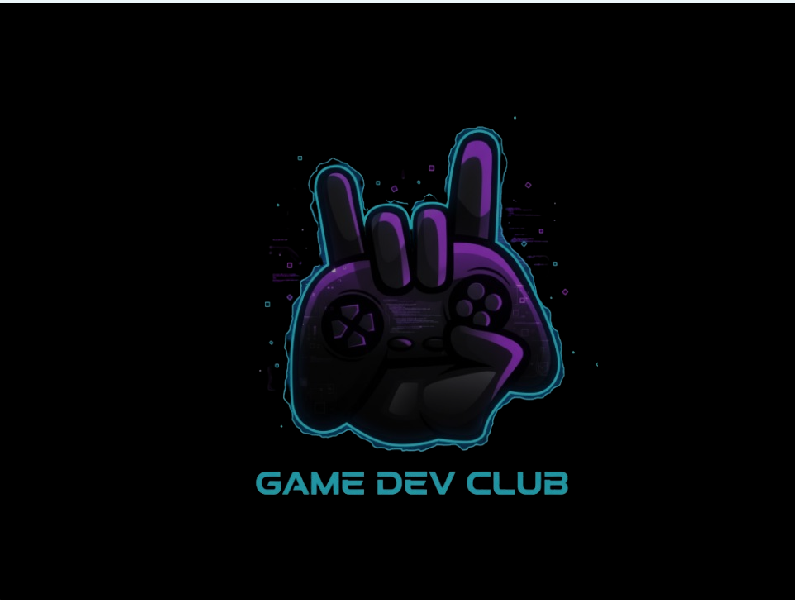
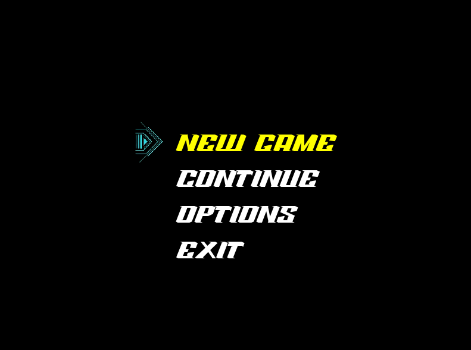
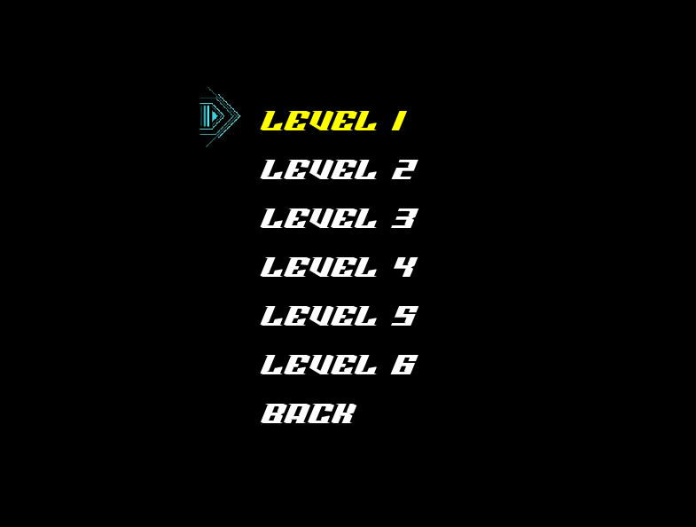
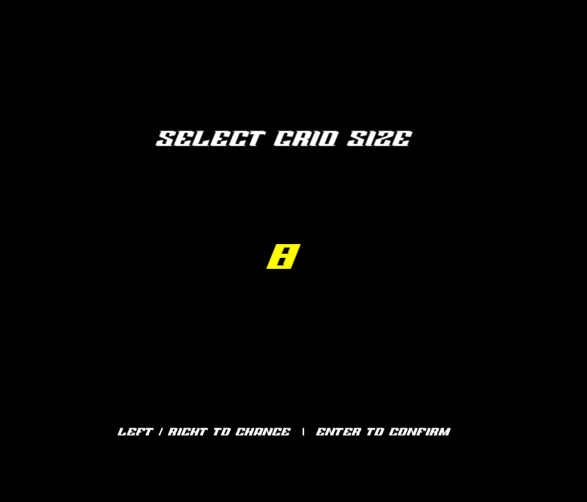
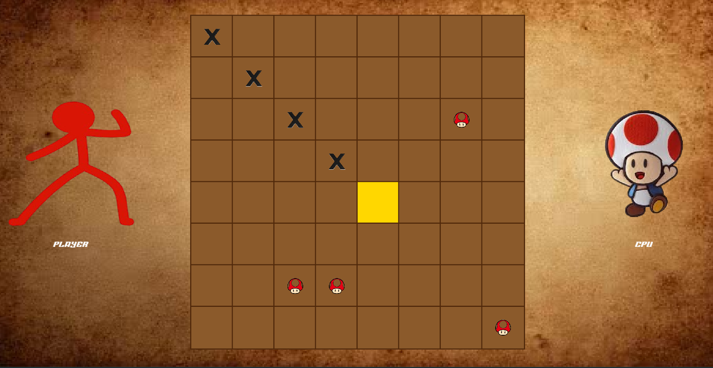
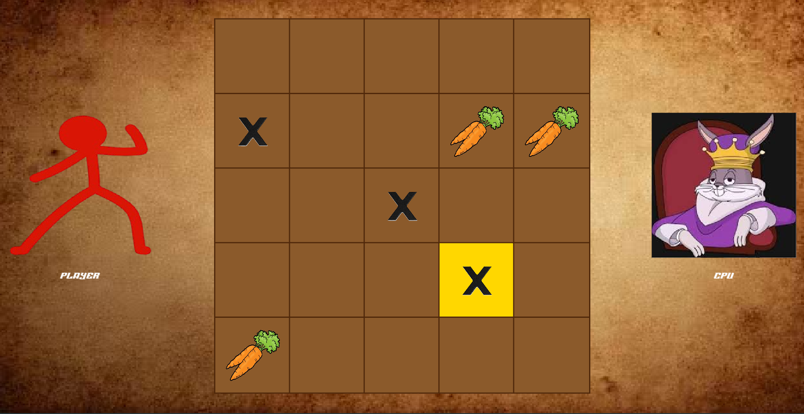
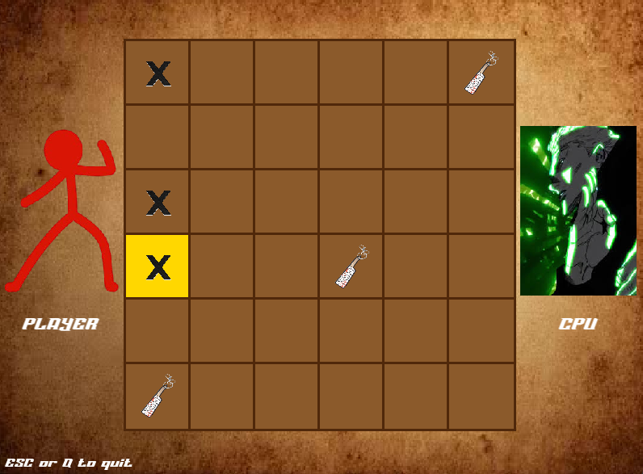
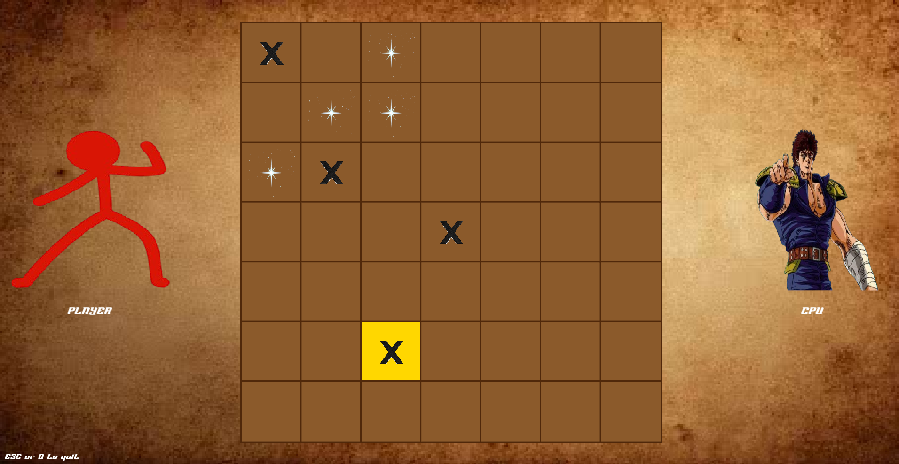
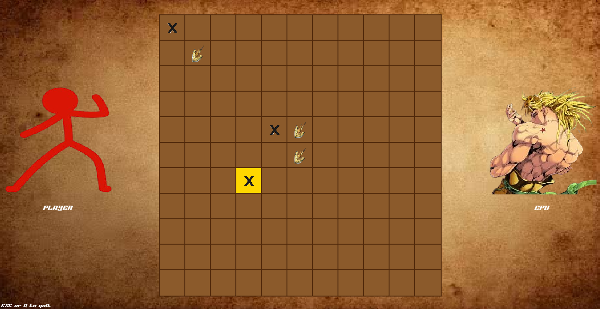
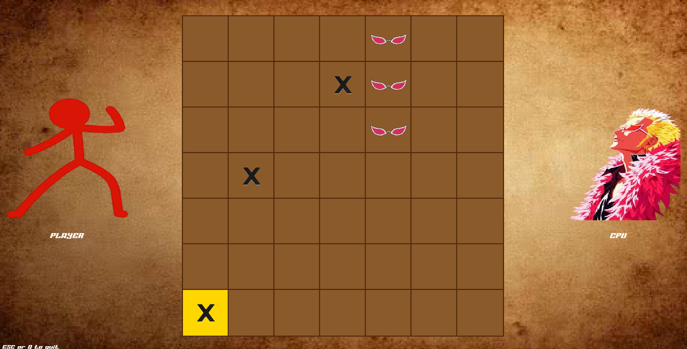

# TicTacToe

A feature-rich TicTacToe game built in **C++ with SFML**, developed as part of the **Game Dev Club**. Play on variable grid sizes against 6 unique CPU opponents, each powered by a different AI algorithm.

---

## Screenshots

### Intro Screen

### Main Menu

### Level Select

### Grid Size Selection

### Gameplay — Level 1 (8x8 grid)

### Gameplay — Level 2 (5x5 grid)

### Gameplay — Level 3 (6x6 grid)

### Gameplay — Level 4 (7x7 grid)

### Gameplay — Level 5 (11x11 grid)

### Gameplay — Level 6 (7x7 grid)

---

## Features

- **Variable grid sizes** — choose any grid from 3x3 up to 17x17
- **6 difficulty levels** — each with a unique CPU opponent and AI algorithm
- **Best of 3 rounds** — first to win 2 rounds wins the match
- **Win condition** — get `min(gridSize, 5)` in a row to win
- **Unique characters** — each level has its own player and CPU avatars
- **Background music and SFX** — unique audio per level
- **Proportional scaling** — UI adapts to any window size including fullscreen
- **Golden cursor** — navigate the board with arrow keys, place with Enter
- **Save & Continue** — quit anytime and resume your game from the main menu

---

## Levels & CPU Algorithms

| Level | CPU Opponent | Algorithm | Difficulty |
|-------|-------------|-----------|------------|
| 1 | Toad | Random Move | ⭐ |
| 2 | King Bugs Bunny | Greedy / One-Move Lookahead | ⭐⭐ |
| 3 | Special Grade Hakari | Rule-Based Heuristic | ⭐⭐⭐ |
| 4 | Kenshiro | Minimax with Limited Depth | ⭐⭐⭐⭐ |
| 5 | Vampire Dio Brando | Full Minimax + Alpha-Beta Pruning | ⭐⭐⭐⭐⭐ |
| 6 | Celestial Dragon Doflamingo | Monte Carlo Tree Search (MCTS) | ⭐⭐⭐⭐⭐⭐ |

---

## How to Play

1. Launch the game
2. Select **NEW GAME** from the main menu
3. Choose a **level** (1 = easiest, 6 = hardest)
4. Select your **grid size** using Left/Right arrow keys, confirm with Enter
5. Use **arrow keys** to move the cursor around the board
6. Press **Enter** to place your symbol
7. First to win **2 rounds** wins the match
8. Press **Q or ESC** at any time to quit and save your progress
9. Select **CONTINUE** from the main menu to resume your last game

---

## Built With

- **C++17**
- **SFML 3** — graphics, audio, windowing
- **MVC Architecture** — data classes separated from render classes
- **Strategy Pattern** — CPU AI algorithms are fully modular and swappable